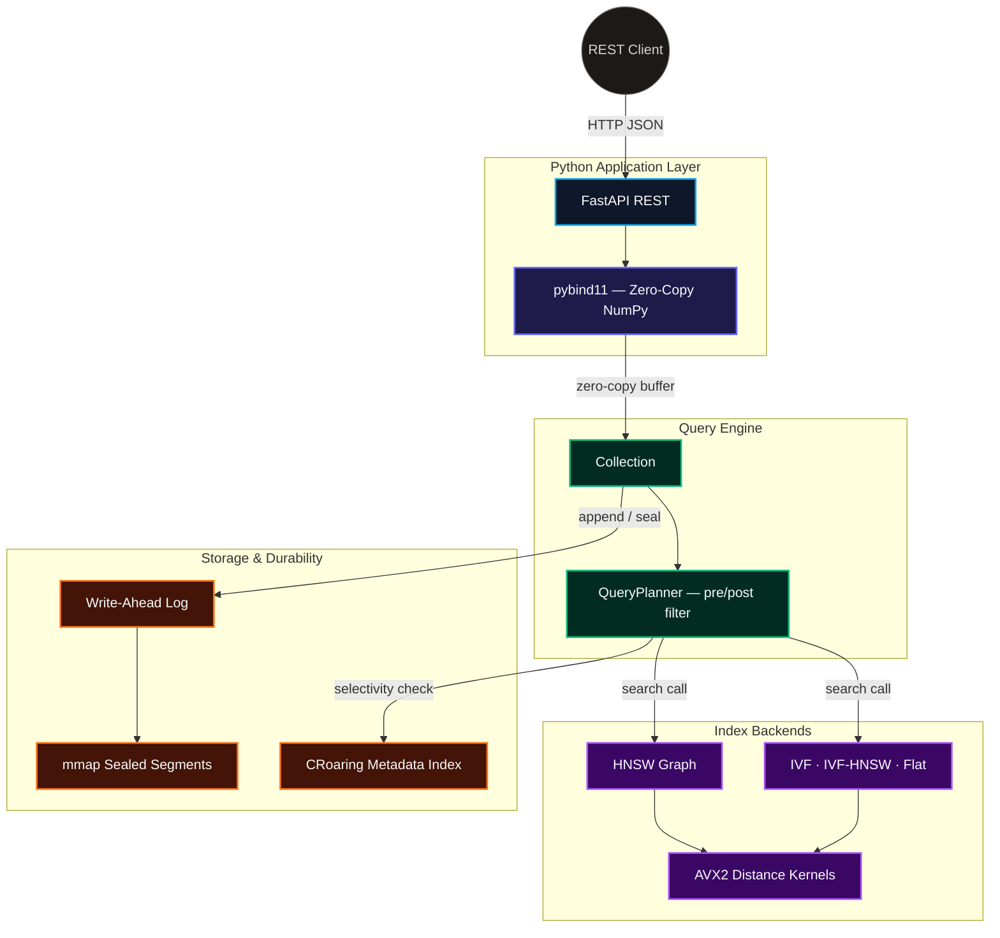

# NovaVec


A vector database built from first principles in C++20 including HNSW graph search, IVF clustering, AVX2 SIMD distance kernels, WAL crash recovery, and a selectivity-based query planner, exposed through a Qdrant-compatible REST API.


## Project Overview

**NovaVec** is a vector similarity search engine implementing approximate nearest-neighbor search entirely from first principles. The core engine is written in C++20 and implements HNSW, IVF, and IVF-HNSW indexing, SIMD-accelerated distance computation, write-ahead logging (WAL), metadata filtering, and selectivity-aware query planning without relying on external ANN libraries such as Faiss or hnswlib.

A Python binding layer built with `pybind11` exposes the engine through zero-copy NumPy interoperability and powers a FastAPI REST service with Qdrant-inspired APIs.

On the ANN-Benchmarks SIFT-1M dataset (1,000,000 vectors, 128 dimensions), NovaVec achieves **99.54% Recall@10 at 2,260 QPS with 0.58 ms p99 latency**.

---

# Benchmark Results

## 1. Recall–Latency Pareto Curve
**Dataset:** SIFT-1M (1,000,000 vectors)  
**Index:** HNSW (M=16, ef_construction=200)

| ef_search | Recall@10 | QPS | p50 (ms) | p99 (ms) |
|-----------|-----------|---------:|---------:|---------:|
| 10 | 0.7115 | 22,009 | 0.04 | 0.08 |
| 20 | 0.8379 | 15,656 | 0.06 | 0.10 |
| 50 | 0.9481 | 7,575 | 0.13 | 0.18 |
| 100 | 0.9854 | 4,217 | 0.24 | 0.31 |
| **200** | **0.9954** | **2,260** | **0.46** | **0.58** |
| 500 | 0.9991 | 773 | 1.22 | 2.55 |

The results show the expected HNSW tradeoff between recall and throughput. The operating point used throughout the project is **ef_search=200**, which achieves **99.54% Recall@10** while maintaining **2,260 queries/sec** and **sub-millisecond p99 latency**.

## 2. Index Comparison

**Dataset:** SIFT-1M (1,000,000 vectors)

| Index | Recall@10 | QPS | p99 Latency |
|--------|---------:|---------:|---------:|
| HNSW | 0.9954 | 2,260 | 0.58 ms |
| IVF | 0.9977 | 82.2 | 19.50 ms |
| Flat (Exact Search) | 0.9992 | 31.1 | 38.92 ms |

Among NovaVec's current index implementations, HNSW provides the strongest recall-throughput tradeoff, delivering near-exact recall while maintaining several orders of magnitude higher throughput than brute-force search.

## 3. HNSW Connectivity Tradeoff

**Dataset:** SIFT-1M  
**ef_search = 200**

| M | Recall@10 | QPS |
|----|---------:|---------:|
| 8 | 0.9819 | 2,403 |
| 16 | 0.9954 | 2,260 |
| 32 | 0.9974 | 1,741 |
| 64 | 0.9974 | 1,642 |

Increasing graph connectivity improves recall, but returns diminish beyond **M=32**. NovaVec's default configuration uses **M=16**, which captures most of the recall gains while preserving higher query throughput.

## 4. Cross-Dataset Validation

NovaVec was evaluated on multiple ANN-Benchmarks datasets spanning different dimensionalities and similarity metrics.

| Dataset | Dimensions | Metric | Recall@10 |
|----------|---------:|----------|---------:|
| SIFT-1M | 128 | Euclidean (L2) | 0.9954 |
| GloVe-100 | 100 | Cosine | 0.9329 |
| Fashion-MNIST | 784 | Euclidean (L2) | 0.9988 |

These results demonstrate that the implementation generalizes across both Euclidean and cosine similarity spaces while maintaining high recall on datasets ranging from 100 to 784 dimensions.

---

## Implemented Components

* **HNSW Index:** Hierarchical Navigable Small World graph with multi-layer probabilistic construction, diverse neighbor selection heuristic, and generation-counter visited sets for zero-allocation beam search.
* **IVF & IVF-HNSW Hybrid:** K-means++ initialized inverted file index, with per-cluster HNSW sub-graphs and parallel cluster probing via `std::async`.
* **Flat Index:** Brute-force exact search used as the correctness oracle for recall validation.
* **AVX2 Distance Kernels:** Hand-written 256-bit SIMD intrinsics (`_mm256_fmadd_ps`, `_mm256_loadu_ps`) for L2, cosine, and inner-product distance, with scalar fallback.
* **Write-Ahead Log:** Binary append-only log with CRC32 per-entry checksums (`zlib`) and three configurable fsync policies (`SYNC_ALWAYS`, `SYNC_PERIODIC`, `SYNC_NEVER`).
* **Segment Storage:** mmap-backed immutable segments with `madvise(MADV_RANDOM)`, atomic mutable/sealed segment rotation under `std::shared_mutex`.
* **Metadata Inverted Index:** CRoaring compressed bitmaps for field-value filtering with SIMD-accelerated set intersection.
* **Selectivity-Based Query Planner:** Automatically switches between pre-filter (bitmap-masked graph traversal) and post-filter (overfetch-then-discard) strategies based on estimated filter selectivity.
* **Zero-Copy Python Bindings:** `pybind11` buffer protocol bridges NumPy arrays directly into C++ without copying.

---

## Architecture & Component Layers

NovaVec is organized into five layers, separating the user-facing Python API from the durability and indexing internals:




### Component Breakdown

| Layer | Component / Files | Role & Description |
| :--- | :--- | :--- |
| **API** | `api/main.py`, `api/routes/` | FastAPI REST layer with Qdrant-compatible request schemas, Prometheus metrics, and structured JSON logging. |
| **Binding** | `bindings/python_bindings.cpp` | Exposes `Collection` to Python via pybind11; uses the buffer protocol for zero-copy NumPy access on upsert and search. |
| **Query** | `collection.cpp`, `query_engine.cpp`, `query_planner.cpp` | Top-level user API; orchestrates filter-strategy selection and result enrichment. |
| **Index** | `hnsw_index.cpp`, `ivf_index.cpp`, `ivf_hnsw_index.cpp`, `flat_index.cpp` | Four interchangeable index backends implementing a common `BaseIndex` interface. |
| **Distance** | `distance.cpp` | AVX2 and scalar L2/cosine/inner-product kernels; cosine reduces to dot product via insert-time normalization. |
| **Storage** | `segment_manager.cpp`, `wal.cpp`, `mmap_store.cpp`, `metadata_store.cpp` | WAL-backed mutable segments, mmap-backed sealed segments, and a CRoaring inverted index for metadata filtering. |

---

## Key Design Decisions

| Decision | Alternative Rejected | Reasoning |
| :--- | :--- | :--- |
| Flat contiguous `float*` vector storage | `std::vector<float>` per node | Single allocation per segment; vector *i* is `data + i*dim` with no pointer indirection — critical for cache locality during distance computation. |
| Generation-counter visited set | `std::unordered_set<int>` per query | O(1) visited check via array compare against an atomic counter; zero heap allocation per query at 2,000+ QPS. |
| Diverse neighbor selection heuristic | Naive k-nearest neighbor | Forces each neighbor to cover a distinct direction from the query, preventing graph fragmentation into disconnected dense clusters. |
| CRoaring compressed bitmaps | `std::vector<DocId>` per field value | SIMD-accelerated set intersection; 10–40KB for 10K-element sets vs. ~400KB for `unordered_set`. |
| Selectivity-based query planner | Always pre-filter / always post-filter | Below 20% selectivity, post-filter overfetch exceeds 5×; bitmap pre-filtering during graph traversal is cheaper. |
| `mmap` for sealed segments | `read()` into a buffer | No double-buffering — OS page cache *is* the buffer; `madvise(MADV_RANDOM)` disables wasteful sequential readahead. |

---

## How to Build and Run

### Prerequisites

* A C++20-compliant compiler (GCC 12+, Clang 14+).
* CMake 3.18 or higher.
* `zlib1g-dev` for WAL checksums.
* Python 3.10+ with `numpy` for the bindings.
* *(Optional)* `libhdf5-dev` to build `bench_runner` for ANN-benchmark datasets.

### Compilation

```bash
# Configure and build — fetches CRoaring, nlohmann/json, and pybind11 automatically
cmake -B build -DCMAKE_BUILD_TYPE=Release
cmake --build build -j$(nproc)
```

### Running the REST API

```bash
pip install -r requirements.txt
export PYTHONPATH=$PWD/build:$PYTHONPATH
uvicorn api.main:app --reload
```

Swagger UI is available at `http://localhost:8000/docs`.

### Running from Python directly

```python
import novavec, numpy as np

col = novavec.Collection(name="demo", dim=128, metric="cosine", index_type="hnsw")
col.upsert(1, np.random.rand(128).astype(np.float32), {"category": "science"})

results = col.search(np.random.rand(128).astype(np.float32), top_k=5)
for r in results:
    print(r.id, r.score, r.metadata())
```

---

## Benchmarking Against ANN-Benchmark Datasets

```bash
wget http://ann-benchmarks.com/sift-128-euclidean.hdf5
python3 benchmarks/bench_recall.py --dataset sift-128-euclidean.hdf5 --queries 1000
python3 benchmarks/plot_pareto.py
```

This sweeps `ef_search ∈ {10, 20, 50, 100, 200, 500}`, computes Recall@10 against exact ground truth, and writes `benchmarks/results/pareto_curve.png`.

---

## Future Work

- **Product Quantization (PQ):** Compress vectors into compact codes to reduce memory footprint at large scale.
- **Cross-Segment Graph Compaction:** Rebuild a unified HNSW graph across sealed segments to improve recall.
- **PostgreSQL Integration:** Expose NovaVec as a native Postgres index using `pgrx`.
- **Hybrid Retrieval:** Combine vector similarity with BM25 keyword ranking for mixed semantic and lexical search.
